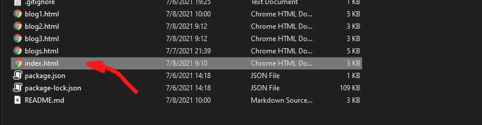

<p align="center">
  <a href="https://github.com/gkgeorgiev18/internship-project" rel="noopener">
    
  </a>
</p>

<h1 align="center">Omne enim blog</h1>

<div align="center">

  []() 
  [](https://github.com/gkgeorgiev18/internship-project/issues)
  [](https://github.com/gkgeorgiev18/internship-project/graphs/contributors)

</div>

## 📝 Table of Contents
- [Description](#description)
- [Getting Started](#installation)
- [Built Using](#built_using)
- [Authors](#authors)
- [Presentation and Documentation](#documentation)

## 📖 Description <a name="description"></a>
This is our internship project for MusalaSoft which consists of a site that has blogs and a database where users' information is stored. The site is built with HTML, CSS, Bootstrap, JavaScript and Node JS and we used SQL for the database.

## 📮 Getting Started <a name="installation"></a>
To get a local copy up and running follow these simple steps.
### Installation
1. Clone the repo
   ```sh
   git clone https://github.com/gkgeorgiev18/internship-project.git
   ```
2. Open index.html


## 💻 Built Using <a name="built_using"></a>
- [HTML](https://html.com/) - Website Skeleton
- [CSS](https://www.w3.org/Style/CSS/Overview.en.html) - Website Design
- [Bootstrap](https://getbootstrap.com/) - Website Design
- [Node JS](https://nodejs.org/en/) - Connection between the database and the website
- [MSSQL](https://www.microsoft.com/en-us/sql-server/sql-server-2019) - Database

## 👥 Authors <a name="authors"></a>
- [Georgi Georgiev](https://github.com/gkgeorgiev18) - Front-End Developer
- [Petar Dyakov](https://github.com/pmdyakov18) - Back-End Developer

## 📋 Presentation and Documentation <a name="documentation"></a>
* [Documentation](https://codingburgas-my.sharepoint.com/:w:/g/personal/pmdyakov18_codingburgas_bg/EcXHPUMsTYRPhhH-5eqNfJYBX1LT0W1euS-y__2uTEp_hg?e=yGbNxA)
* [Presentation](https://codingburgas-my.sharepoint.com/:p:/g/personal/pmdyakov18_codingburgas_bg/EXqvTR5q9_NMk1pKlSuFAxEB19bsGgigQhrZZq10XYY9Dg?e=oBXanL)